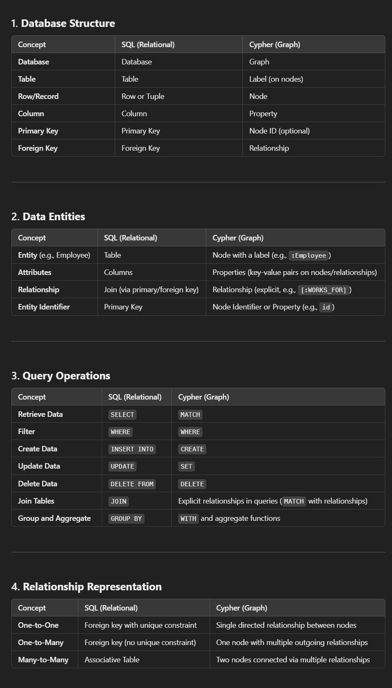

Copyright (C) 2025 Penan Rajput  <br>
Name : Penan Rajput <br>
Email : <penanrajput1998@gmail.com> <br>
[Follow on LinkedIn ](https://www.linkedin.com/in/penanrajput)




# CYPHER Queries Cheatsheet

1. Database

    Cypher does not support Database, still can be used

    1. Show Databases
    ```sql
    SHOW databases;
    ```

    2. Use particular database (not working)

    ```sql
    use <database_name>
    ```

    3. to view current database (not working)
    
    ```sql
    :db current
    ```


    4. Show All tables within current database = To show all labels (which represent node types):
    ```sql
    CALL db.labels()
    YIELD label
    RETURN label;
    ```


1. CREATE/INSERT NODE in Cypher = CREATE TABLE in SQL

    i. CREATE 1 NODE
    ```sql
    CREATE (:Employee 
                {
                    id:1, 
                    first_name:"Penan",
                    last_name:"Rajput", 
                    age:20, 
                    salary:100000
                }
            )
    ```

    ii. CREATE 1 NODE and RETURN IT

    ```sql
    CREATE (n:Employee 
            {
                id:1, 
                first_name:"Penan",
                last_name:"Rajput", 
                age:20, 
                salary:100000
            }
        ) RETURN n
    ```
    ii. +1 row & RETURN IT

    ```sql
    # STRUCTURE
    CREATE (
                :Table_Name {id:1}
            ), 
            (
                :Table_Name {id:2}
            )
    ```

    ```sql
    CREATE (n:Emp {id:1, name:"Chetan"}), 
            (p:Emp {id:2, name:"Penan"}) 
    RETURN n, p
    ```
    iii. INSERT 1 column with pre-defined value
    ```sql
    MATCH (p:Employee) SET p.COUNTRY = "IND";
    ```

    iv. MODIFY set value to particular node
    ```sql
    MATCH (n:Employee {id:2}) 
    SET n.salary = "20000";
    ```

3. RETURN in Cypher Queries = SELECT in SQL

    i. RETURN ALL COLUMNS
    ```sql
    MATCH(n:Employee) RETURN n;
    ```

    ```sql
    MATCH(n:Employee) RETURN properties(n);
    ```

    ii. RETURN +1 COLUMN 

    ```sql
    MATCH(n:Employee) RETURN n, properties(n);
    ```

    iii. RETURN +1 "name" column
    ```sql
    MATCH(n:Employee) RETURN n.name
    ```

    iv. RETURN +1 "name" & "Id" column
    ```sql
    MATCH(n:Emp) RETURN n.name, n.id    
    ```

4. MATCH + WHERE

    i. WHERE + RETURN
    ```sql
    MATCH(n:Employee) WHERE n.id = 1 RETURN n
    ```


5. MATCH + DELETE

    i. WHERE + DELETE = DROPS the Employee node
    ```
    MATCH(n:Employee) WHERE n.id = 1 DELETE n
    ```

    ii. WHERE + DELETE + RETURN = DROPS the Employee node and RETURN IT
    ```
    MATCH(n:Employee) WHERE n.id = 1 DELETE n RETURN n
    ```

    iii.


6. OPERATORS

    i. AND
    ```sql
    MATCH(n:Employee) WHERE n.id = 1 AND n.name = "Penan" RETURN n
    ```
    ii. OR
    ```sql
    MATCH(n:Employee) WHERE n.id = 1 OR n.name = "Penan" RETURN n
    ```
    iii. NOT
    ```sql
    MATCH(n:Employee) WHERE NOT n.id = 1 RETURN n
    ```
    iv. IN
    ```sql
    MATCH(n:Employee) WHERE n.id IN [1,2] RETURN n
    ```
    v. BETWEEN
    ```sql
    MATCH(n:Employee) WHERE n.id BETWEEN 1 AND 2 RETURN n
    ```
    vi. LIKE
    ```sql
    MATCH(n:Employee) WHERE n.name LIKE "Penan" RETURN n
    ```
    vii. IS NULL
    ```sql
    MATCH(n:Employee) WHERE n.name IS NULL RETURN n
    ```
    viii. IS NOT NULL
    ```sql
    MATCH(n:Employee) WHERE n.name IS NOT NULL RETURN n

# RELATIONSHIP

1. CREATE RELATIONSHIP
    i. CREATE 2 NODE & 1 RELATIONSHIP AT SAME TIME
    ```sql
    CREATE (n:Employee {id:1, name:"Penan", age:21, salary:100})
    CREATE (p:Employee {id:2, name:"Aron", age:22, salary:110})
    CREATE (n)-[:WORKS_IN]->(p)
    ```
    ii. CREATE 2 NODE & RELATIONSHIP AT SAME TIME and RETURN IT
    ```sql
    CREATE (n:Employee {id:1, name:"Penan", age:21, salary:100})
    CREATE (p:Employee {id:2, name:"Aron", age:22, salary:110})
    CREATE (n)-[:WORKS_IN]->(p) RETURN n, p
    ```

    iii. CREATE 2 NODE & THEN LATER CREATE RELATIONSHIP BETWEEN THEM
    ```sql
    <!-- 1st Step -->
        CREATE (:Emp {id:1, name:"Penan", age:21, salary:100}),
       (:Emp {id:2, name:"Aron", age:22, salary:110}),
       (:Dept {id:1, name:"HR"}),
       (:Dept {id:2, name:"Engineering"});
    ```
    ```sql
    <!-- 2nd Step -->
    MATCH (e:Emp {name: "Penan"}), (d:Dept {name: "HR"})
    CREATE (e)-[:WORKS_IN]->(d);
    ```
    ```sql
    [:WORKS_IN]: Defines the type of the relationship. You can customize the relationship type name as needed.
    ```

    iv. PRINT RELATIONSHIP
    ```sql
    SYNTAX:
    MATCH (a)-[r]->(b)
    RETURN a, r, b;

    This query:

    Matches all relationships in the graph ([r]).

    Returns 
    the starting node (a), 
    the relationship (r), and 
    the ending node (b).
    ```
    ```sql
    MATCH (e:Emp)-[r:WORKS_IN]->(d:Dept)
    RETURN e, r, d;
    ```

    <b>TABULAR VIEW</b>
    ```sql
    
    MATCH (e:Emp)-[r:WORKS_IN]->(d:Dept)
    RETURN e.name AS Employee, r AS Relationship, d.name AS Department;
    ```

    This query shows:
    ```
    Employee names.
    The relationship details.
    Department names in a table format.
    ```

    

# SAMPLE DATABASE
```sql
CREATE (:Emp {id:1, name:"Penan", age:21, salary:100}),
        (:Emp {id:2, name:"Aron", age:22, salary:110}),
        (:Emp {id:3, name:"Robert", age:23, salary:190}),
        (:Emp {id:4, name:"Rockstar", age:24, salary:160}),
        (:Emp {id:5, name:"John", age:26, salary:180}),
        (:Emp {id:6, name:"Jack", age:27, salary:170})
```


# TOPICS In CYPHER / NODE4J


1. Basic Operations

        Node Creation: Creating nodes with labels and properties.
        Relationship Creation: Establishing relationships between nodes.
        Reading Data: Querying nodes, relationships, and paths.
        Updating Data: Updating properties of nodes and relationships.
        Deleting Data: Deleting nodes, relationships, or both.
2. Advanced Matching

        Pattern Matching: Using patterns to find specific nodes or paths.
        Optional Matching: Handling missing relationships using OPTIONAL MATCH.
        Variable-Length Paths: Matching paths of arbitrary lengths.
        Conditional Matching: Filtering results with WHERE clauses.

3. Relationship Queries

        Types of Relationships: Querying specific relationship types.
        Direction of Relationships: Matching relationships in a specific direction.
        Quantified Path Patterns: Working with advanced path matching.
4. Aggregation and Grouping

        Aggregation Functions: Using COUNT, SUM, AVG, MIN, MAX.
        Grouping Results: Grouping data using WITH.
5. Functions

        String Functions: toUpper(), toLower(), substring(), etc.
        Numeric Functions: abs(), ceil(), floor(), etc.
        Date/Time Functions: Working with temporal data.
        Collection Functions: Manipulating lists and collections.
        Spatial Functions: Working with geospatial data.
6. Data Modeling

        Labels and Properties: Structuring data with labels and key-value pairs.
        Constraints: Enforcing data integrity with uniqueness or property constraints.
        Indexes: Optimizing query performance.
7. Path Queries

        Shortest Path: Finding the shortest path between two nodes.
        All Paths: Finding all possible paths between nodes.
        Weighted Paths: Working with paths that have weights.
8. Subqueries

        Nested Queries: Using subqueries to process intermediate results.
        Unwind: Expanding collections into rows for processing.
9. Data Import and Export

        Importing Data: Using CSV files with LOAD CSV.
        Exporting Data: Exporting query results to external systems.
10. Full-Text Search

        Using full-text indexing for advanced search capabilities.
11. Security

        User Authentication: Managing user roles and permissions.
        Data Masking: Protecting sensitive information.
12. Transactions and Performance

        Transactions: Managing multi-step operations.
        Query Tuning: Using PROFILE and EXPLAIN to optimize queries.
13. Advanced Topics

        Graph Algorithms: Centrality, community detection, etc.
        APOC Procedures: Leveraging the APOC plugin for enhanced capabilities.
        Data Integration: Connecting Neo4j with external systems (e.g., Kafka, Elasticsearch).

14. Visualization

        Displaying graph data in the Neo4j browser or external visualization tools.
15. Integration with Other Languages

        Using Cypher with Java, Python, JavaScript, and other programming languages via Neo4j drivers.