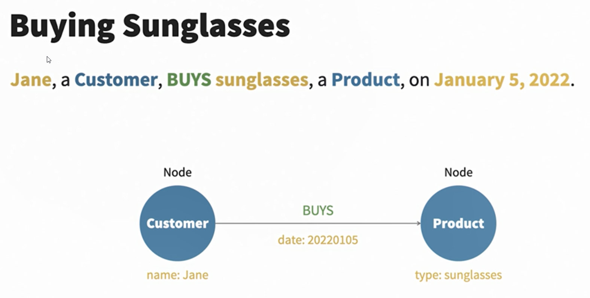

Copyright (C) 2025 Penan Rajput  <br>
Name : Penan Rajput <br>
Email : <penanrajput1998@gmail.com> <br>
[Follow on LinkedIn ](https://www.linkedin.com/in/penanrajput)


# Property Graph Components
## Nodes

## Relationships

## Labels

## Properties


# Example





# Example 2


```sql
CREATE (learner:Learner {name:"Penan"}),
        (hello:Greeting {message:"Hello, World!"}),
        (learner) - [r:SAYS] -> (hello)
```

```
Added 2 labels, created 2 nodes, set 2 properties, created 1 relationship, completed after 22 ms.
```


```sql
MATCH(learner:Learner) - [rel] - (greeting:Greeting)
RETURN *
```


# NEO4J UI Shortcuts
1. Double Click on node to open node details
2. Double Click on relationship to open relationship details
3. Double Click on label to open label details
4. Double Click on property to open property details
5. Double Click on property value to open property value details

# Introducing Cypher
* Graph query language
* Declarative
* Everything is a pattern
```sql
(penan:Learner {name:"Penan"}) - [r:SAYS] -> (text:Greeting {message:"Hello, World!"})
```

## Representing Graph Patterns: Nodes
```sql
() - a node
(referenceA)
(referenceA:Label)
(referenceA:Label {propertyKey:value})

() = a node
(p:Person) 
        p = node variable/referenceA
        Person = node label
        {propertyKey:value} = node properties
        propertyKey = property key
        value = property value

```

## Representing Graph Patterns: Relationships
```sql
--    = A relationship
-->   = A relationship with direction
-[]-> = (also) A Relationship with direction 

-[refB]-> 
-[refB:TYPE]
```

Example : 
```sql
CREATE (learner:Learner {name:"Penan"})-[:SAYS]->(greeting:Greeting {message:"Nice To Meet You!"}) 
```


## MATCHING nodes
* MATCHing nodes
* MATCHing properties on nodes

```sql
//Return all nodes in the database (limit to 10 results)
MATCH (n)
RETURN n LIMIT 10
```


```sql
//Return all nodes that have a Student label (limit to 10 results)
MATCH (n:Student)
RETURN n LIMIT 10
```


```sql
//Return all nodes that have a property first (name) with value 'Alia'
MATCH (n {first:'Alia'})
RETURN n
```

```sql
//Return all nodes that have a Student label and property first with value 'Alia'
//This query should be faster when we use a label!
MATCH (n:Student {first:'Alia'})
RETURN n
```

```sql
//Return all nodes that have a Student label and property first with value 'Alia'
//We can also use WHERE
MATCH (n:Student)
WHERE n.first = 'Alia'
RETURN n
```

```sql
//Return all Year nodes after 2006
MATCH (n:Year)
WHERE n.value > 2006
RETURN n
```


## MATCHing Nodes and Relationships
```sql
//Return all students with the first name Alia who've studied abroad
MATCH (s:Student {first:'Alia'})--(c:Country)
RETURN *
```

```sql
//Return all students with the first name Alia who have studied abroad 
//This query should be faster when we use a relationship type and direction!
MATCH (s:Student {first:'Alia'})-[:STUDIED_ABROAD_IN]->(c:Country)
RETURN *
```

```sql
//Return all students with a GPA above 3.98
MATCH (s:Student)-[r:OBTAINED]->()
WHERE r.gpa >3.98
RETURN s.first, s.last, r.gpa
```

```sql
//Return all students with firstname Alia with a GPA above 3.0
MATCH (s:Student)-[r:OBTAINED]->()
WHERE r.gpa >3.0 AND s.first = 'Alia'
RETURN s.first, s.last, r.gpa
```

```sql
//Return all students with firstname Alia with a GPA above 3.0
//We can change our references using AS
MATCH (s:Student)-[r:OBTAINED]->()
WHERE r.gpa >3.0 AND s.first = 'Alia'
RETURN s.first AS Name, s.last AS `Family Name`, r.gpa AS GPA
```


## Counting and aggregating data
```sql
//How many students studied abroad?
MATCH (s:Student)-[:STUDIED_ABROAD_IN]->(c:Country)
RETURN count(s) AS `Students Abroad`
```

```sql
//Find and collect all students with firstname Alia or Colleen who studied abroad and in which country
MATCH (s:Student)-[:STUDIED_ABROAD_IN]->(c:Country)
WHERE s.first = 'Alia' OR s.first = 'Colleen'
RETURN collect(s.first + ' ' + s.last) AS Name, c.name AS Country
```

```sql
//Find how many students who studied abroad per country
MATCH (s:Student)-[:STUDIED_ABROAD_IN]->(c:Country)
WITH collect(s) AS students, c
RETURN size(students) AS `Number of Students`, c.name AS Country
```

```sql
//RETURN 10 students in ascending alphabetical order on first name
MATCH (s:Student)
RETURN s.first, s.last ORDER BY s.first LIMIT 10
```

```sql
//Find how many students who studied abroad per country, ordered from highest to lowest
MATCH (s:Student)-[:STUDIED_ABROAD_IN]->(c:Country)
WITH collect(s) AS students, c
RETURN size(students) AS Students, c.name AS Country ORDER BY Students DESC
```

```sql
//WITH and WHERE example
//Find countries where at least 150 students studied there
MATCH (s:Student)-[:STUDIED_ABROAD_IN]->(c:Country)
WITH collect(s) AS students, c WHERE size(students) >= 150
RETURN size(students) AS `Number of Students`, c.name AS Country
```


# CYPHER Queries Cheatsheet

1. Database

    Cypher does not support Database, still can be used

    1. Show Databases
    ```sql
    SHOW databases;
    ```

    2. Use particular database (not working)

    ```sql
    use <database_name>
    ```

    3. to view current database (not working)
    
    ```sql
    :db current
    ```


    4. Show All tables within current database = To show all labels (which represent node types):
    ```sql
    CALL db.labels()
    YIELD label
    RETURN label;
    ```


1. CREATE/INSERT NODE in Cypher = CREATE TABLE in SQL

    i. CREATE 1 NODE
    ```sql
    CREATE (:Employee 
                {
                    id:1, 
                    first_name:"Penan",
                    last_name:"Rajput", 
                    age:20, 
                    salary:100000
                }
            )
    ```

    ii. CREATE 1 NODE and RETURN IT

    ```sql
    CREATE (n:Employee 
            {
                id:1, 
                first_name:"Penan",
                last_name:"Rajput", 
                age:20, 
                salary:100000
            }
        ) RETURN n
    ```
    ii. +1 row & RETURN IT

    ```sql
    # STRUCTURE
    CREATE (
                :Table_Name {id:1}
            ), 
            (
                :Table_Name {id:2}
            )
    ```

    ```sql
    CREATE (n:Emp {id:1, name:"Chetan"}), 
            (p:Emp {id:2, name:"Penan"}) 
    RETURN n, p
    ```
    iii. INSERT 1 column with pre-defined value
    ```sql
    MATCH (p:Employee) SET p.COUNTRY = "IND";
    ```

    iv. MODIFY set value to particular node
    ```sql
    MATCH (n:Employee {id:2}) 
    SET n.salary = "20000";
    ```

3. RETURN in Cypher Queries = SELECT in SQL

    i. RETURN ALL COLUMNS
    ```sql
    MATCH(n:Employee) RETURN n;
    ```

    ```sql
    MATCH(n:Employee) RETURN properties(n);
    ```

    ii. RETURN +1 COLUMN 

    ```sql
    MATCH(n:Employee) RETURN n, properties(n);
    ```

    iii. RETURN +1 "name" column
    ```sql
    MATCH(n:Employee) RETURN n.name
    ```

    iv. RETURN +1 "name" & "Id" column
    ```sql
    MATCH(n:Emp) RETURN n.name, n.id    
    ```

4. MATCH + WHERE

    i. WHERE + RETURN
    ```sql
    MATCH(n:Employee) WHERE n.id = 1 RETURN n
    ```


5. MATCH + DELETE

    i. WHERE + DELETE = DROPS the Employee node
    ```
    MATCH(n:Employee) WHERE n.id = 1 DELETE n
    ```

    ii. WHERE + DELETE + RETURN = DROPS the Employee node and RETURN IT
    ```
    MATCH(n:Employee) WHERE n.id = 1 DELETE n RETURN n
    ```

    iii.


6. OPERATORS

    i. AND
    ```sql
    MATCH(n:Employee) WHERE n.id = 1 AND n.name = "Penan" RETURN n
    ```
    ii. OR
    ```sql
    MATCH(n:Employee) WHERE n.id = 1 OR n.name = "Penan" RETURN n
    ```
    iii. NOT
    ```sql
    MATCH(n:Employee) WHERE NOT n.id = 1 RETURN n
    ```
    iv. IN
    ```sql
    MATCH(n:Employee) WHERE n.id IN [1,2] RETURN n
    ```
    v. BETWEEN
    ```sql
    MATCH(n:Employee) WHERE n.id BETWEEN 1 AND 2 RETURN n
    ```
    vi. LIKE
    ```sql
    MATCH(n:Employee) WHERE n.name LIKE "Penan" RETURN n
    ```
    vii. IS NULL
    ```sql
    MATCH(n:Employee) WHERE n.name IS NULL RETURN n
    ```
    viii. IS NOT NULL
    ```sql
    MATCH(n:Employee) WHERE n.name IS NOT NULL RETURN n

# RELATIONSHIP

1. CREATE RELATIONSHIP
    i. CREATE 2 NODE & 1 RELATIONSHIP AT SAME TIME
    ```sql
    CREATE (n:Employee {id:1, name:"Penan", age:21, salary:100})
    CREATE (p:Employee {id:2, name:"Aron", age:22, salary:110})
    CREATE (n)-[:WORKS_IN]->(p)
    ```
    ii. CREATE 2 NODE & RELATIONSHIP AT SAME TIME and RETURN IT
    ```sql
    CREATE (n:Employee {id:1, name:"Penan", age:21, salary:100})
    CREATE (p:Employee {id:2, name:"Aron", age:22, salary:110})
    CREATE (n)-[:WORKS_IN]->(p) RETURN n, p
    ```

    iii. CREATE 2 NODE & THEN LATER CREATE RELATIONSHIP BETWEEN THEM
    ```sql
    <!-- 1st Step -->
        CREATE (:Emp {id:1, name:"Penan", age:21, salary:100}),
       (:Emp {id:2, name:"Aron", age:22, salary:110}),
       (:Dept {id:1, name:"HR"}),
       (:Dept {id:2, name:"Engineering"});
    ```
    ```sql
    <!-- 2nd Step -->
    MATCH (e:Emp {name: "Penan"}), (d:Dept {name: "HR"})
    CREATE (e)-[:WORKS_IN]->(d);
    ```
    ```sql
    [:WORKS_IN]: Defines the type of the relationship. You can customize the relationship type name as needed.
    ```

    iv. PRINT RELATIONSHIP
    ```sql
    SYNTAX:
    MATCH (a)-[r]->(b)
    RETURN a, r, b;

    This query:

    Matches all relationships in the graph ([r]).

    Returns 
    the starting node (a), 
    the relationship (r), and 
    the ending node (b).
    ```
    ```sql
    MATCH (e:Emp)-[r:WORKS_IN]->(d:Dept)
    RETURN e, r, d;
    ```

    <b>TABULAR VIEW</b>
    ```sql
    
    MATCH (e:Emp)-[r:WORKS_IN]->(d:Dept)
    RETURN e.name AS Employee, r AS Relationship, d.name AS Department;
    ```

    This query shows:
    ```
    Employee names.
    The relationship details.
    Department names in a table format.
    ```

    

# SAMPLE DATABASE
```sql
// Step 1: Delete all existing Employee nodes
MATCH (e:Employee) DETACH DELETE e;

// Step 2: Create new Employee nodes
CREATE (:Employee {id:1, name:"Penan", age:21}),
        (:Employee {id:2, name:"Aron", age:22, salary:110}),
        (:Employee {id:3, name:"Penan", age:23})
```

# MERGE

```sql

MERGE is a clause used to ensure that specific patterns (nodes, relationships, or both) exist in the database. 

If the pattern does not exist, Cypher will create it. 

If it does exist, Cypher will match it. 

This is particularly useful for avoiding duplicate data.
```


## Key Points About MERGE
<b>Matching:</b>
        If a node or relationship with the specified properties and structure already exists, MERGE will match it.
        
<b>Creating:</b>
        If the pattern does not exist, MERGE creates it.

<b>Conditional Actions:</b>
        You can define actions to take whether the pattern is matched or created using ON MATCH and ON CREATE.

## Why Use MERGE?
* To prevent duplicate nodes or relationships.
* To combine "find or create" logic into a single statement.
* To maintain data consistency in scenarios where uniqueness is important.


## Ex 1. If node does not exists


```sql
// Step 1: Delete all existing Employee nodes
MATCH (e:Employee) DETACH DELETE e;

// Step 2: Create new Employee nodes
CREATE (:Employee {id:1, name:"Penan", age:21}),
        (:Employee {id:2, name:"Aron", age:22, salary:110}),
        (:Employee {id:3, name:"Penan", age:23})
```

```sql
// 3rd Step :
MERGE (n:Employee {age: 26})
RETURN n;
```


## Ex 2. Ensure a Node Exists

* When you use MERGE in Cypher, it tries to match the specified pattern first. If the pattern (node, relationship, or both) already exists, MERGE simply matches it and does nothing else by default. 
* It does not create duplicates or change the existing pattern unless you explicitly define actions with ON MATCH
```sql
// Step 1: Delete all existing Employee nodes
MATCH (e:Employee) DETACH DELETE e;

// Step 2: Create new Employee nodes
CREATE (:Employee {id:1, name:"Penan", age:21}),
        (:Employee {id:2, name:"Aron", age:22, salary:110}),
        (:Employee {id:3, name:"Penan", age:23})
```


* If a node labeled Person with name = "Penan" already exists, it will match it means does nothing.

### 2a = MERGE Containing all the properties
```sql
// 3rd Step :
MERGE (n:Employee {name :"Penan", id: 1, age:21})
RETURN n;

MATCH(n:Employee) RETURN n
```


### 2b = MERGE Containing some the properties
```sql
// 3rd Step :
MERGE (n:Employee {name :"Penan"})
RETURN n;

MATCH(n:Employee) RETURN n
```


<b>
Lesson : We can some of the properties inside MATCH and no need to mention all the properties.
</b>

## Ex 3. Ensure a Relationship Exists
```sql
MERGE (p1:Person {name: "Alice"})-[:KNOWS]->(p2:Person {name: "Bob"})
RETURN p1, p2;
```
* If the KNOWS relationship between Alice and Bob exists, it will match it.
* If not, it will create the relationship.

## Ex 4. Use ON CREATE and ON MATCH


```sql
MERGE (n:Employee {name: "Penan"})
ON CREATE SET n.createdAt = timestamp()
ON MATCH SET n.lastAccessed = timestamp()
RETURN n;
```
* If the node is created, it sets the createdAt property.


* If the node is matched, it updates the lastAccessed property.


Overall Result


# TOPICS In CYPHER / NODE4J


# 1. Basic Operations

        Node Creation: Creating nodes with labels and properties.
        Relationship Creation: Establishing relationships between nodes.
        Reading Data: Querying nodes, relationships, and paths.
        Updating Data: Updating properties of nodes and relationships.
        Deleting Data: Deleting nodes, relationships, or both.
# 2. Advanced Matching

        Pattern Matching: Using patterns to find specific nodes or paths.
        Optional Matching: Handling missing relationships using OPTIONAL MATCH.
        Variable-Length Paths: Matching paths of arbitrary lengths.
        Conditional Matching: Filtering results with WHERE clauses.

# 3. Relationship Queries

        Types of Relationships: Querying specific relationship types.
        Direction of Relationships: Matching relationships in a specific direction.
        Quantified Path Patterns: Working with advanced path matching.
# 4. Aggregation and Grouping

        Aggregation Functions: Using COUNT, SUM, AVG, MIN, MAX.
        Grouping Results: Grouping data using WITH.
# 5. Functions

        String Functions: toUpper(), toLower(), substring(), etc.
        Numeric Functions: abs(), ceil(), floor(), etc.
        Date/Time Functions: Working with temporal data.
        Collection Functions: Manipulating lists and collections.
        Spatial Functions: Working with geospatial data.
# 6. Data Modeling

        Labels and Properties: Structuring data with labels and key-value pairs.
        Constraints: Enforcing data integrity with uniqueness or property constraints.
        Indexes: Optimizing query performance.
# 7. Path Queries

        Shortest Path: Finding the shortest path between two nodes.
        All Paths: Finding all possible paths between nodes.
        Weighted Paths: Working with paths that have weights.
# 8. Subqueries

        Nested Queries: Using subqueries to process intermediate results.
        Unwind: Expanding collections into rows for processing.
# 9. Data Import and Export

## Importing Data: Using CSV files with LOAD CSV.

file.csv
```sql
student_name,college_name,student_id,college_id
Alice,Harvard,1,101
Bob,Stanford,2,102
Charlie,MIT,3,103
Alice,MIT,1,103
```

```sql
LOAD CSV WITH HEADERS FROM 'file:///students_colleges.csv' AS row

// Create or Match Student Nodes
MERGE (student:Student 
        { id: toInteger(row.student_id) }
      )
SET student.name = row.student_name

// Create or Match College Nodes
MERGE (college:College 
        { id: toInteger(row.college_id) }
        )
SET college.name = row.college_name

// Create the STUDIES Relationship
MERGE (student)-[:STUDIES]->(college);
```


## Exporting Data: Exporting query results to external systems.


# 10. Full-Text Search

        Using full-text indexing for advanced search capabilities.
# 11. Security

        User Authentication: Managing user roles and permissions.
        Data Masking: Protecting sensitive information.
# 12. Transactions and Performance

        Transactions: Managing multi-step operations.
        Query Tuning: Using PROFILE and EXPLAIN to optimize queries.
# 13. Advanced Topics

        Graph Algorithms: Centrality, community detection, etc.
        APOC Procedures: Leveraging the APOC plugin for enhanced capabilities.
        Data Integration: Connecting Neo4j with external systems (e.g., Kafka, Elasticsearch).

# 14. Visualization

        Displaying graph data in the Neo4j browser or external visualization tools.
# 15. Integration with Other Languages

        Using Cypher with Java, Python, JavaScript, and other programming languages via Neo4j drivers.